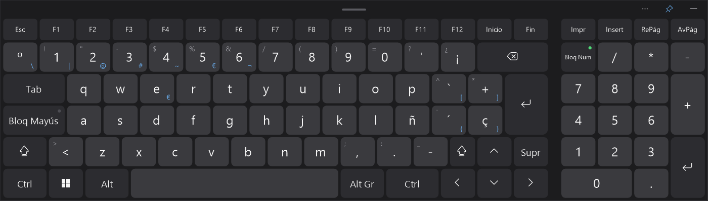
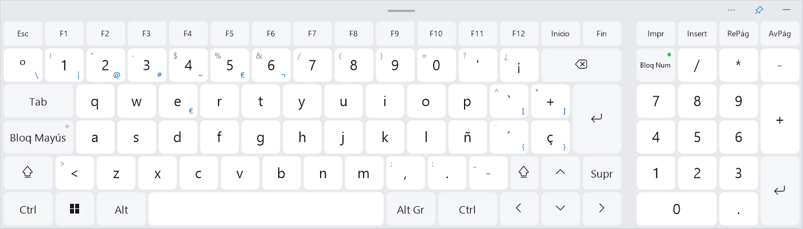

# Teclado Flotante

[English](README.md) · **Español**

> 🧪 **Beta abierta.** Ya se puede usar a diario, pero puede tener fallos. Si encuentras alguno, [abre un issue](https://github.com/Danii204/teclado-flotante/issues) contando qué hacías y, si puedes, adjunta el registro `%APPDATA%\TecladoFlotante\log.txt`.

Teclado en pantalla para Windows 10 y 11, pensado para sustituir a los que trae Windows: se coloca en **cualquier parte de la pantalla** (también arriba del todo), se **redimensiona libremente**, ocupa lo mínimo en marcos y **nunca roba el foco** a la aplicación en la que estás escribiendo.




## Descarga

**[⬇ Descargar la última versión](https://github.com/Danii204/teclado-flotante/releases)**: en la versión más reciente, descarga `TecladoFlotante-Setup.exe` (≈ 100 KB, no necesita permisos de administrador).

1. Abre `TecladoFlotante-Setup.exe` y pulsa **Instalar**.
2. Si Windows muestra *«Windows protegió su PC»*, pulsa **Más información → Ejecutar de todas formas**. Aparece porque el programa no está firmado con un certificado de pago; el código es este mismo repositorio y cada versión publica su huella SHA-256.

Se instala solo para tu usuario, crea un acceso directo **Teclado Flotante** en el escritorio, se abre al terminar y, a partir de entonces, arranca solo al encender el PC. Para instalar una versión nueva encima no hace falta desinstalar ni cerrar nada.

## Uso

| Acción | Cómo |
| --- | --- |
| Mostrar / ocultar | Acceso directo del escritorio, icono de la barra de tareas, botón flotante azul o **Ctrl+Alt+K** |
| Mover | Arrastra la barra superior o cualquier hueco entre teclas |
| Cambiar el tamaño | Arrastra cualquier borde o esquina (se guarda automáticamente) |
| Siempre encima | Botón 📌 de la barra superior |
| Menú | Botón ⋯ o clic derecho |

- **Acentos** como en un teclado físico: `´` + `a` = á, `Mayús` + `´` + `u` = ü, también `` ` `` y `^`.
- **AltGr** para @ # € [ ] { } \ | ~ ¬.
- **Mayús, Ctrl, Alt, AltGr y Win** quedan activas hasta la siguiente tecla (Ctrl → C = Ctrl+C). Win dos veces abre el menú Inicio.
- **Bloque numérico** con Bloq Num: desactivado, funciona como flechas, Inicio, Fin, RePág, AvPág, Insert y Supr.
- Mantener pulsada una tecla la repite.

### Opciones (menú)

- **Distribución:** Español (España) o English (US).
- **Tema:** automático (sigue al tema de Windows), claro u oscuro.
- **Letra en negrita** para leer mejor las teclas.
- **Mostrar al tocar un campo de texto:** si está activado, al hacer clic o tocar donde se puede escribir, el teclado aparece solo.
- **Bloque numérico** y **fila de funciones** (F1–F12): se pueden ocultar; la ventana se ajusta y las teclas mantienen su tamaño. Sin la fila de funciones, Esc pasa a la fila de los números.
- **Opciones:** siempre encima, opacidad (también con la rueda del ratón sobre la barra superior), botón flotante al minimizar, iniciar con Windows y **qué mostrar al encender el PC** (nada, el botón flotante o el teclado).
- **Recordar la posición al reiniciar.** Por defecto, cada vez que el programa arranca el teclado aparece **centrado** con el **tamaño que tenías guardado**; así, pase lo que pase, al volver a abrirlo siempre está a la vista.

## Actualizaciones

Sin entrar en GitHub ni saber nada de informática: cuando hay una versión nueva aparece un botón azul **Actualizar** en la barra del teclado (y un punto naranja en el botón flotante). Un toque en **Actualizar ahora** y listo.

El programa comprueba cada 12 horas si hay una versión nueva en [Releases](https://github.com/Danii204/teclado-flotante/releases) (durante la beta abierta, también las marcadas como *Pre-release*). Si la hay, avisa en la bandeja: **un clic** y se descarga, se verifica (SHA-256), se instala y vuelve a abrirse solo. También se puede comprobar a mano desde *Ayuda y actualizaciones → Buscar actualizaciones ahora*, o desactivar el aviso.

## Privacidad

- **No recopila ni envía ningún dato.** No hay telemetría, estadísticas ni cuentas.
- La única conexión a Internet es una consulta anónima a `api.github.com` para ver si hay una versión nueva (y la descarga del instalador si aceptas actualizar). Se puede desactivar en el menú.
- No registra lo que escribes. La opción «mostrar al tocar un campo de texto» solo detecta que hubo un clic y si el elemento enfocado es editable; no lee su contenido. El registro de errores (`%APPDATA%\TecladoFlotante\log.txt`) solo contiene mensajes técnicos, se queda en tu equipo y nunca se envía.

## Robustez

- No roba el foco (`WS_EX_NOACTIVATE`): lo que tecleas va siempre a la ventana en la que estabas.
- Los avisos aparecen siempre por encima del teclado, donde no los tape, y con botones grandes.
- Ajustes guardados de forma atómica: un apagado repentino no los corrompe; si el archivo está dañado se usan valores por defecto.
- Si el programa falla, se registra el error y se vuelve a abrir solo, centrado.
- Si desconectas un monitor o cambias la resolución, el teclado vuelve a la vista.
- Una sola instancia: abrirlo otra vez solo muestra el teclado que ya está en marcha.

## Desinstalar

*Configuración → Aplicaciones → Aplicaciones instaladas → Teclado Flotante → Desinstalar.* Se eliminan el programa, sus ajustes, el acceso del menú Inicio y el arranque automático.

## Limitaciones conocidas

- No puede escribir en programas que se ejecutan **como administrador** (por ejemplo, el Administrador de tareas): Windows lo impide a cualquier programa sin firma especial (UIAccess).
- En Windows 11 el programa pide que su icono se vea en la barra de tareas; si alguien lo movió antes a la flecha `^`, se respeta esa elección (se puede volver a arrastrar a la barra).

## Compilar desde el código

No hace falta instalar nada: se usa el compilador de C# de .NET Framework 4.8, incluido en Windows.

```powershell
.\build.ps1          # genera dist\TecladoFlotante-Setup.exe
.\test.ps1 unit      # pruebas sin ratón
.\test.ps1           # pruebas completas: mueve el ratón y escribe en una ventana de prueba
.\test.ps1 render    # capturas del teclado en obj\test\img
```

Estructura: `src/` código de la aplicación, `tests/` banco de pruebas, `.github/workflows/` compilación y publicación automáticas.

### Publicar una versión

1. Añade en `CHANGELOG.md` la sección `## [X.Y.Z] - AAAA-MM-DD`.
2. Ejecuta `.\release.ps1 X.Y.Z`. Mientras el archivo `CHANNEL` diga `beta`, se publica como *Pre-release* con la etiqueta `vX.Y.Z-beta`; cámbialo a `stable` para la primera versión estable.

GitHub Actions compila, prueba y crea la Release con el instalador y su SHA-256; los equipos con el programa instalado recibirán el aviso.

## Licencia

[MIT](LICENSE) © [Danii204](https://github.com/Danii204)
